# Trading bots ecosystem — snapshot

**Generated:** 2026-09-10, from a live scan of the NAS "Blackhole" (`docker ps -a`, `docker inspect`,
`docker logs`, deployed `docker-compose.yml` files under `/Volume1/public/Docker/`, plus each bot's
local repo clone where one exists).

This is a **point-in-time snapshot**, not a living doc — several containers changed state *during*
this very scan (see "Found during this scan" below). For current behavior, each bot's own `TODO.md`
/ `README.md` in its own repo is the source of truth; this file is only meant to answer "what runs
where, and what talks to what."

Scope: bots that place or evaluate orders on a real market/venue, plus their direct supporting
infrastructure (shared broker gateway, shared data feed, shared dashboard). Out of scope: NAS system
utilities, MCP tool servers, home-automation containers, network/firmware tooling — none of those
touch a market.

---

## IBKR cluster (Interactive Brokers paper account)

### `ib-gateway` — shared broker gateway (not a bot)
`gnzsnz/ib-gateway-docker`, one shared headless IB Gateway process logged into **one paper account**
(`<paper-account-id>`, ~$1M virtual). Raw port 4002 is loopback-only; sibling containers reach it through a
socat relay on port 4004. Two bots connect to it with distinct `clientId`s. This is the single most
important shared-risk fact in the whole ecosystem: **both IBKR bots trade on the exact same paper
account and see each other's fills.** Confirmed live during this scan — `ibkr-forecastex-bot`'s own
log stream at 22:00:44 was broadcasting `updatePortfolio` events for equity-trading-bot's stock
positions (AAPL, MSFT, NVDA, JPM, AMZN, ENI, RACE, BMW, ALV, AI, OR, KR, BTSG, AHR, SOLS) — IBKR
pushes account-wide portfolio updates to *every* connected client, not just the one that placed the
order.

### `equity-trading-bot` — US/EU equities & ETFs
clientId `201`. Built and extensively reworked tonight (2026-09-09/10). Three independent capital
sleeves, all reconciled separately so they never net against each other:
- **Tactical** (daily): a dynamically-ranked ~15-symbol slice of a ~1279-symbol US+EU universe
  (S&P 500/400, FTSE MIB, DAX, CAC, FTSE 100, IBEX, AEX, SMI, OMX, Euro Stoxx 50), each symbol
  running whichever of `ma_crossover` / `trend_ema_rsi` / `meanrev_bollinger` back-tested with
  Sharpe > 0 for it.
- **Buy-and-hold ETF sleeve** (weekly): 20% of the account's real NetLiquidation, split across a
  protection ETF (XEON.MI, cash-like) and 5 broad equity-index ETFs, buy-only, dip-gated on a
  50-day moving average, never sells.
- **Market-reports sleeve** (daily, **shipped but disabled by default**): 5% of real
  NetLiquidation, trades the user's own external claude.ai research picks (momentum + value,
  refreshed daily) with a stop-loss + rotation exit rule, except three hardcoded symbols
  (`VWCE.MI`, `SWDA.MI`, `BRK-B`) that are never auto-sold.

Orders use GTC time-in-force with a cancel-and-replace guard (fixed tonight — DAY orders were being
silently cancelled by IBKR when placed outside an exchange's trading hours, a real risk once the
universe started spanning multiple time zones). Cron: 22:40 Europe/Rome, deliberately staggered off
`:00`/`:30` to avoid colliding with the other IBKR bot on the shared gateway (see next). GitHub:
`HAL9000RELOADED/equity-trading-bot` (private).

### `ibkr-forecastex-bot` — IBKR ForecastEx prediction markets
clientId `101`. A separate line of work (ForecastEx strategies ported from the Polymarket bots
below), polling market data every 30 minutes at `:00`/`:30` — this is *why* equity-trading-bot's own
cron had to move to `:40`, confirmed by a real collision (`IBKR Error 10197`) the first time the two
ran too close together. Reads the **same shared news archive** as `news-scanner-agent` /
`polymarket-signal-agent` (`SHARED_NEWS_DB_PATH`, one host directory bind-mounted read-only-by-
convention — see news section). GitHub: `HAL9000RELOADED/ibkr-forecastex-bot` (private).

---

## Crypto / Binance cluster

### `crypto-trading-bot` + `crypto-futures-bot`
Same image (`crypto-trading-bot:latest`), two differently-configured instances. Observed config on
the spot instance (before it went down mid-scan, see below): cross-sectional momentum
(`CRYPTO_STRATEGIES=xs_momentum`) on 4h bars, a 120-period regime filter, top-10 of an 84-bar
lookback ranking held at rank ≤25, up to 15 open positions, 5% position sizing, 20%/10% take-
profit/stop-loss, synthetic fee 0.1%. `crypto-futures-bot` is presumably the same strategy family
applied to futures rather than spot (per its container name and per a prior session's memory of
"xs_momentum guardrails" work), but this could not be independently confirmed tonight — see below.

**Not independently verifiable tonight**: neither a local repo clone (only `binance-trading-bot`
exists locally, and that one is explicitly a *different*, early-stage, testnet-only scaffold with no
risk management yet — it does not match this deployment's much more mature config) nor a
`HAL9000RELOADED` GitHub repo for `crypto-trading-bot`/`crypto-futures-bot` could be found. Whatever
builds/maintains this deployment isn't visible from this machine's local clones or this GitHub
account's repo list.

---

## Polymarket cluster (all confirmed paper/dry-run, live-checked tonight)

### `polymarket-signal-agent`
Paper-only by design (README states no wallet, no private key, no on-chain order capability —
`requests`/`feedparser` only, virtual portfolio in local SQLite). Live tonight: 30 open positions,
today's realized P&L -$35.72, total realized +$2743.05.

### `polymarket-whale-copy` and `polymarket-arb-bot`
Both run the `polymarket-arb-bot:latest` image as separate instances/configs. `polymarket-whale-copy`
(confirmed live: 42 open positions, equity $8336.60, realized $6651.53) copies large/"whale" wallets'
trades in paper mode. `polymarket-arb-bot` itself (confirmed live: scanning ~200 trades every cycle,
essentially idle — "0 copiati" on nearly every cycle tonight) is the read-only whale/insider/cluster/
dispute intelligence suite plus a dry-run copy-trading path.

---

## Shared data & visualization layer

### `nas-market-scraper`
The market-data backbone: scrapes equities/ETFs (the ~1279-symbol universe above) and crypto/Binance
snapshots, publishes them to a public GitHub archive (`HAL9000RELOADED/Claude-probe1`,
`history/daily/` etc. — this repo). Everything equity-trading-bot's tactical/ETF-sleeve backtests run
on ultimately traces back to this feed. **New tonight**: this same repo also now hosts
`market-reports/` — a small daily mirror of the user's own external claude.ai research artifacts
(momentum/value picks + weekly strategy), kept fresh by a scheduled cloud routine
(`market-reports-mirror`, daily 21:15 UTC) built specifically to feed equity-trading-bot's new
market-reports sleeve. Unrelated in *purpose* to the scraper's own market data, but living in the
same repo by convention.

### `news-scanner-agent` (+ `libretranslate`)
Multi-source world-news scanner; the "third leg" alongside `nas-market-scraper` and
`polymarket-signal-agent` per its own README. Writes a shared SQLite news archive that
`polymarket-signal-agent` and `ibkr-forecastex-bot` both read (read-only by app-level
`PRAGMA query_only`, not by filesystem permission — the bind mount itself is read-write because
SQLite's WAL mode needs to create companion files even for readers). `libretranslate` is a
translation sidecar for non-English sources.

### `nas-dashboard-gui`
Read-only Streamlit viewer (port 8501) reading every bot's own report/ledger files — portfolio
charts, the news feed, whale intel, service/CPU/RAM status. Touched tonight: the "IBKR" tabs were
ambiguously labeled (looked like they belonged to equity-trading-bot; they actually show
`ibkr-forecastex-bot`'s data) — relabeled to "IBKR ForecastEx" for clarity, pushed as
`HAL9000RELOADED/nas-dashboard-gui@484ad1c`.

*(A separate, unrelated container called plain `nas-dashboard` — no `-gui` — also runs on the NAS.
It's a generic Docker/NAS status page, not a trading dashboard; confirmed out of scope for this doc.)*

---

## Relationship map

```mermaid
flowchart TB
    subgraph IBKR["IBKR paper account (SHARED)"]
        GW["ib-gateway<br/>(shared broker process)"]
        EQ["equity-trading-bot<br/>clientId 201 · cron 22:40"]
        FX["ibkr-forecastex-bot<br/>clientId 101 · poll :00/:30"]
        EQ -- orders/positions --> GW
        FX -- orders/positions --> GW
        GW -. "account-wide portfolio<br/>updates, visible to both" .-> EQ
        GW -. same .-> FX
    end

    subgraph CRYPTO["Binance (separate account/keys, unverified source)"]
        CTB["crypto-trading-bot<br/>xs_momentum, spot"]
        CFB["crypto-futures-bot<br/>presumed futures variant"]
    end

    subgraph POLY["Polymarket (all paper/dry-run)"]
        PSA["polymarket-signal-agent"]
        PWC["polymarket-whale-copy"]
        PAB["polymarket-arb-bot<br/>(intel + copy scanning)"]
    end

    SCRAPER["nas-market-scraper<br/>equities/ETFs + crypto snapshots"]
    GHARCHIVE[("GitHub: Claude-probe1<br/>history/ + market-reports/")]
    NEWS["news-scanner-agent<br/>+ libretranslate"]
    NEWSDB[("shared news SQLite")]
    DASH["nas-dashboard-gui<br/>(read-only viewer)"]
    ARTIFACT["user's claude.ai<br/>research artifacts"]
    ROUTINE["cloud routine<br/>market-reports-mirror<br/>(daily 21:15 UTC)"]

    SCRAPER -- publishes --> GHARCHIVE
    GHARCHIVE -- backtest data --> EQ
    ARTIFACT -- read by --> ROUTINE
    ROUTINE -- writes --> GHARCHIVE
    GHARCHIVE -- picks --> EQ

    NEWS -- writes --> NEWSDB
    NEWSDB -- reads --> PSA
    NEWSDB -- reads --> FX

    EQ -- reports --> DASH
    FX -- reports --> DASH
    PSA -- reports --> DASH
    PWC -- reports --> DASH
    PAB -- reports --> DASH

    style IBKR fill:#3a1a1a,stroke:#d03b3b
    style CRYPTO fill:#1a2a3a,stroke:#2a78d6
    style POLY fill:#1a3a1a,stroke:#0ca30c
```

---

## Found during this scan

1. **The IBKR shared-account coupling is real and directly observed, not theoretical.** While
   inspecting `ibkr-forecastex-bot`'s logs, its stream was actively broadcasting
   equity-trading-bot's own position updates in real time — concrete proof both bots see (and,
   in principle, could act on knowledge of) each other's fills on the same $1M paper account.
   Nothing indicates either bot currently *reacts* to the other's positions, but the coupling
   itself is structural, not accidental, and worth remembering before adding a third bot to this
   gateway.
2. **`crypto-trading-bot`/`crypto-futures-bot` have no traceable source.** No local repo clone
   matches their deployed config (the only local crypto repo, `binance-trading-bot`, is an
   unrelated, much earlier-stage project), and no matching repo exists under the `HAL9000RELOADED`
   GitHub account. Whatever built and maintains this deployment isn't reachable from this machine.
   Worth finding out where its source actually lives before trusting it unattended.
3. **Both crypto containers vanished mid-scan.** `crypto-futures-bot` was already gone and
   `crypto-trading-bot` went down between two consecutive `docker inspect` calls a few seconds
   apart — almost certainly another session actively redeploying it right now (there's a peer
   session in this workspace named around "crypto-futures-bot xs_momentum guardrails"). Not a
   failure on its own, just a live-moving target during this scan; worth re-checking its status
   later rather than trusting this document's crypto section as current.
4. **Two "nas-dashboard" containers with easily-confused names.** `nas-dashboard-gui` (the trading
   dashboard, documented above) and plain `nas-dashboard` (a generic Docker/NAS status page,
   unrelated to markets) run side by side. Not itself a problem, but a plausible source of future
   confusion — worth a more distinctive name for one of them at some point.
5. **All three Polymarket bots and `polymarket-signal-agent` reconfirmed paper-only** with live
   numbers pulled tonight (30/42 open positions respectively, no wallet/keys present in either
   README) — no surprises there, included for completeness since this doc's whole point is not to
   assert things from memory without checking.

---

*Written by Claude Code, a fork of the session that spent tonight rebuilding equity-trading-bot's
IBKR order handling and adding its two new capital sleeves — this doc was requested specifically
because that work touched a shared, multi-bot account and the user wanted the fuller picture written
down in one place.*
